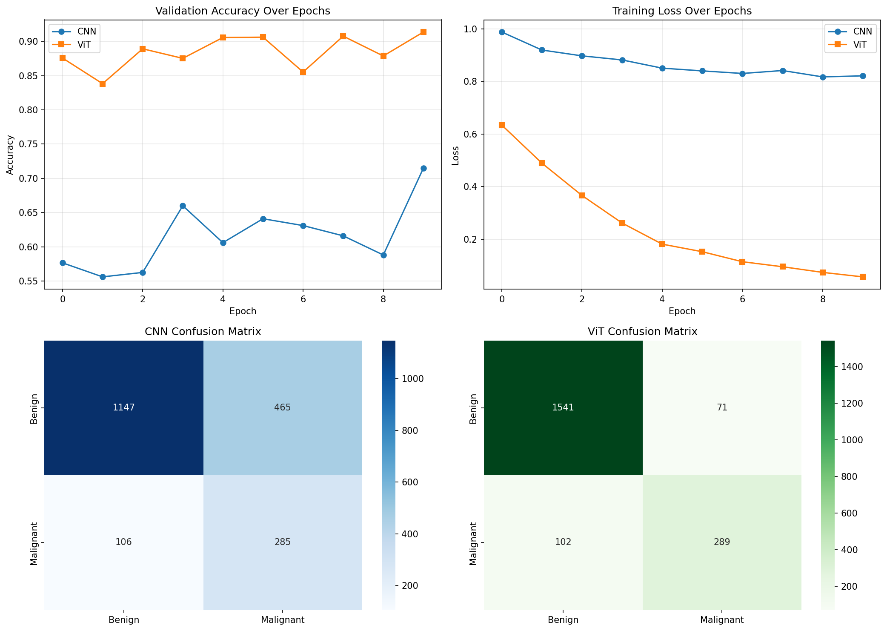

# 🔬 CNN vs Vision Transformer for Skin Cancer Classification

## 📌 Overview
A controlled comparative study between a custom CNN and a pretrained
Vision Transformer (ViT-Base/16) for binary skin lesion classification
on the HAM10000 dataset. Both models trained under identical conditions
with class-weighted loss to handle severe class imbalance (80/20 split).

## 🎯 Key Finding
ViT achieves **91% accuracy** vs CNN's **71%**, with **6.5x fewer
false positives**, while maintaining comparable malignant recall
(74% vs 73%). Transfer learning allows ViT to outperform CNN even
on medium-sized medical datasets.

## 📊 Results

| Metric | CNN | ViT-Base/16 |
|--------|-----|-------------|
| Overall Accuracy | 71% | **91%** |
| Malignant Precision | 38% | **80%** |
| Malignant Recall | 73% | **74%** |
| Malignant F1 | 0.50 | **0.77** |
| False Positives | 465 | **71** |
| Parameters | ~0.4M | ~85.8M |

## 🔑 Key Contributions
1. Controlled head-to-head CNN vs ViT comparison on HAM10000
2. Ablation study showing class-weighted loss is essential
   (without it: 0% malignant recall despite 80.5% accuracy)
3. Clinical analysis of precision-recall tradeoff for
   screening applications

## 🗂️ Dataset
**HAM10000** — Human Against Machine with 10000 training images
- 10,015 dermoscopic images
- 7 diagnostic categories → binary: Benign vs Malignant
- Malignant: mel, bcc, akiec (19.5%)
- Benign: everything else (80.5%)
- Source: [Kaggle](https://www.kaggle.com/datasets/kmader/skin-cancer-mnist-ham10000)

## 🛠️ Tech Stack
| Technology | Purpose |
|------------|---------|
| PyTorch | Model training |
| Hugging Face Transformers | ViT-Base/16 pretrained model |
| Scikit-learn | Evaluation metrics |
| Matplotlib / Seaborn | Visualizations |
| Google Colab T4 GPU | Training environment |

## 🚀 How to Run
1. Open `vit_vs_cnn_skin_cancer.ipynb` in Google Colab
2. Enable T4 GPU (Runtime → Change runtime type)
3. Run all cells in order

## 🔗 Related Projects
- 🧠 [Brain MRI Tumor Segmentation](https://github.com/sami442/medical-image-segmentation)
- 🏥 [CancerShield — Multi-Cancer Detection](https://github.com/sami442/multi-cancer-detection)
- 🩺 [MediScan — 4-Disease Console](https://github.com/sami442/multi-disease-imaging-ai)
- 🏥 [NeuraMed — Medical AI Platform](https://github.com/sami442/neura-med)

## 📄 License
MIT License
